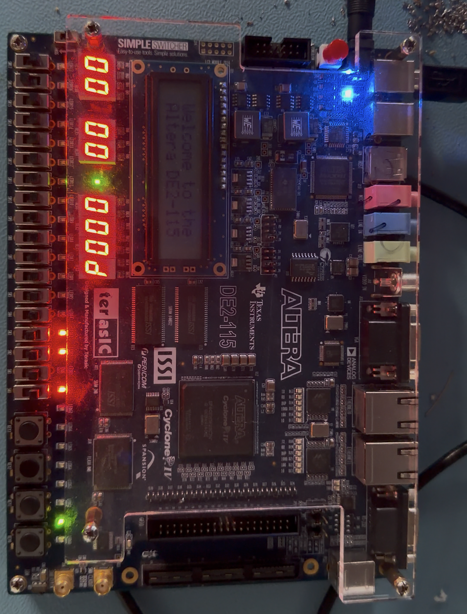
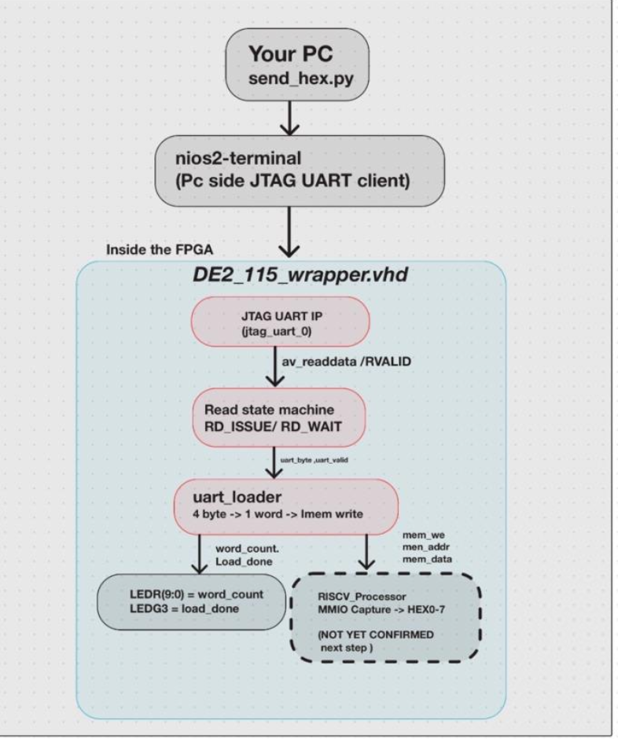

# RISC-V Pipelined Processor — FPGA Wrapper

A 5-stage pipelined RISC-V processor synthesized onto a DE2-115 FPGA, with a custom JTAG UART loader that lets you push a new program onto the board without recompiling or reprogramming the FPGA every time. Built together with a teammate.

## Processor Architecture

## What this solves

Normally, testing a new program on real hardware means recompiling the whole design in Quartus and reprogramming the FPGA — which takes a long time. This project adds a small piece of hardware that sits between the JTAG cable and the processor's instruction memory, so you can:

1. Program the FPGA once with the wrapper.
2. From then on, just send a compiled program over the same JTAG cable, and the board loads and runs it — no recompiling needed.

## How it works

- A Python script (`send_hex.py`) takes a compiled instruction hex file and streams it, 4 bytes at a time, over the JTAG cable using `nios2-terminal` (a generic JTAG UART tool that ships with Quartus — nothing to do with the Nios II processor itself).
- On the FPGA side, a JTAG UART IP block receives the bytes. A small state machine (`uart_loader`) reassembles every 4 bytes into one 32-bit instruction and writes it straight into the processor's instruction memory.
- A special marker value tells the loader when the program is done, so it knows exactly when to stop and release the processor from reset.
- Everything — the JTAG UART, the loader, and the processor — runs on a single 50 MHz clock domain to keep things simple and avoid clock-domain crossing bugs.

## Checking a load worked

Since the Python script can't see inside the FPGA, the board's LEDs are the real feedback:

| LED | Meaning |
|---|---|
| LEDG1 | Power-on reset complete — solid on once |
| LEDG2 | ~3 Hz heartbeat — confirms the clock is alive |
| LEDR(9:0) | Live instruction count (binary) while the program is loading |
| LEDG3 | Load finished — the loader saw the whole program plus the end marker |
| LEDG4 | The processor actually ran the program and hit its halt instruction |
| LEDG0 | Blinks once per byte received — general activity indicator |

## Files

| File | What it is |
|---|---|
| `RISCV_Processor.vhd` | The 5-stage pipelined RISC-V processor |
| `DE2_115_wrapper.vhd` | Top-level FPGA wrapper — connects the JTAG UART, loader, and processor |
| `uart_loader.vhd` | State machine that turns incoming bytes into instruction writes |
| `send_hex.py` | Host-side script that sends a compiled program over JTAG |
| `DE2_115_riscv.qsf` | Quartus project settings/pin assignments for the DE2-115 |

**Dhruv Patel**
[GitHub](https://github.com/Dhruv-2801)

## Current status

The core load-and-run flow works — programs load over JTAG, the instruction count shows live on LEDR, and the board confirms a completed run. The part still in progress is MMIO: getting memory-mapped store data to actually display on the board's HEX0–7 displays. The signals needed for it are already exposed from the processor; wiring that last piece up is next.
